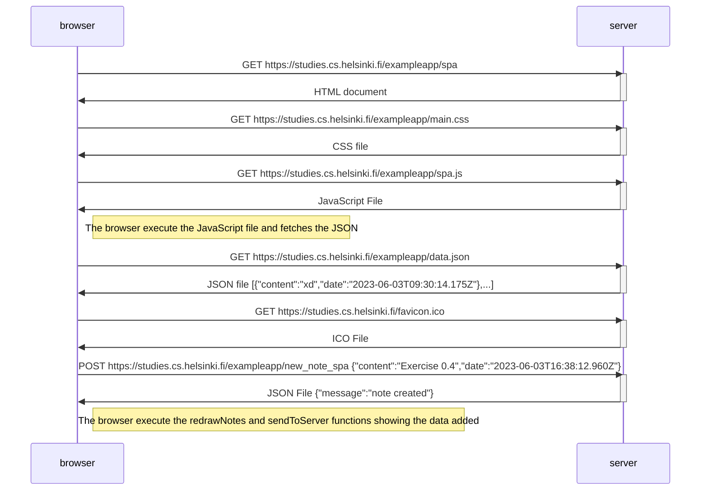

```mermaid
sequenceDiagram
	participant browser
	participant server
	
	browser->>server: GET https://studies.cs.helsinki.fi/exampleapp/spa
	activate server
	server->>browser: HTML document
	deactivate server
	
	browser->>server: GET https://studies.cs.helsinki.fi/exampleapp/main.css
	activate server
	server->>browser: CSS file
	deactivate server
	
	browser->>server: GET https://studies.cs.helsinki.fi/exampleapp/spa.js
	activate server
	server->>browser: JavaScript File
	deactivate server
	
	Note right of browser: The browser execute the JavaScript file and fetches the JSON 
	
	browser->>server: GET https://studies.cs.helsinki.fi/exampleapp/data.json
	activate server
	server->>browser: JSON file [{"content":"xd","date":"2023-06-03T09:30:14.175Z"},...]
	deactivate server
	
	browser->>server: GET https://studies.cs.helsinki.fi/favicon.ico
	activate server
	server->>browser: ICO File
	deactivate server
	
	browser->>server: POST https://studies.cs.helsinki.fi/exampleapp/new_note_spa {"content":"Exercise 0.4","date":"2023-06-03T16:38:12.960Z"}
	activate server
	server->>browser: JSON File {"message":"note created"}
	deactivate server
	
	Note right of browser: The browser execute the redrawNotes and sendToServer functions showing the data added
```
