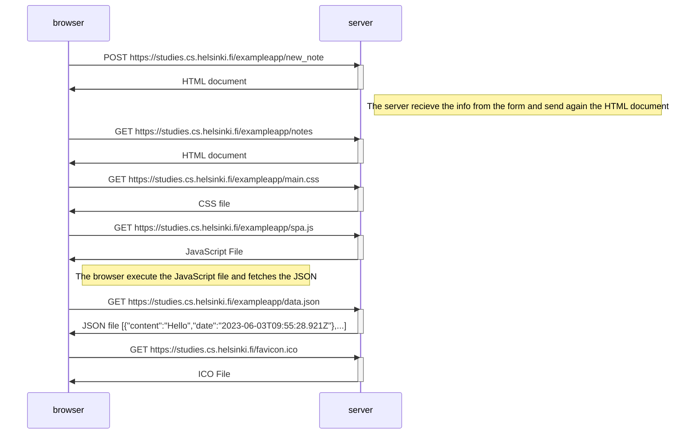

```mermaid
sequenceDiagram
	participant browser
	participant server
	
	browser->>server: POST	https://studies.cs.helsinki.fi/exampleapp/new_note
	activate server
	server->>browser: HTML document
	deactivate server
	
	Note right of server: The server recieve the info from the form and send again the HTML document
	
	
	browser->>server: GET https://studies.cs.helsinki.fi/exampleapp/notes
	activate server
	server->>browser: HTML document
	deactivate server
	
	browser->>server: GET https://studies.cs.helsinki.fi/exampleapp/main.css
	activate server
	server->>browser: CSS file
	deactivate server
	
	browser->>server: GET https://studies.cs.helsinki.fi/exampleapp/spa.js
	activate server
	server->>browser: JavaScript File
	deactivate server
	
	Note right of browser: The browser execute the JavaScript file and fetches the JSON 
	
	browser->>server: GET https://studies.cs.helsinki.fi/exampleapp/data.json
	activate server
	server->>browser: JSON file [{"content":"Hello","date":"2023-06-03T09:55:28.921Z"},...]
	deactivate server
	
	browser->>server: GET https://studies.cs.helsinki.fi/favicon.ico
	activate server
	server->>browser: ICO File
	deactivate server
	
```
